# Ai Career Assistant

---
## 🛠️ Tech Stack

| Category | Technologies |
| :--- | :--- |
| **Backend Frameworks** | Fast Api, Node.js |
| **Ai FrameWork** | LangChain|
| **Browser Automation Tool** | PlayWright|
| **Database** | Postgresql,MongoDb|
| **Vector Database** | FAISS|
| **Embedding Model** |  sentence-transformers/all-MiniLM-L6-v2|
| **Cross Encoder** | cross-encoder/ms-marco-MiniLM-L-6-v2|
| **Containers** | Docker |
| **Back Ground Processing** | Redis Bull Mq|
| **OCR** | EasyOcr|
| **LLM model** | Gemini 3.5 pro|

---
# 🚀 Key Features & Architecture

---

# 1.Adding a New Job Source

---

* **The application is designed to support multiple job sources. To integrate a new career portal, maintainers need to**
* **Implement a dedicated Playwright scraper for the website based on its HTML structure and navigation.**
* **Register the scraper so it can be executed by the scraping pipeline**
  
     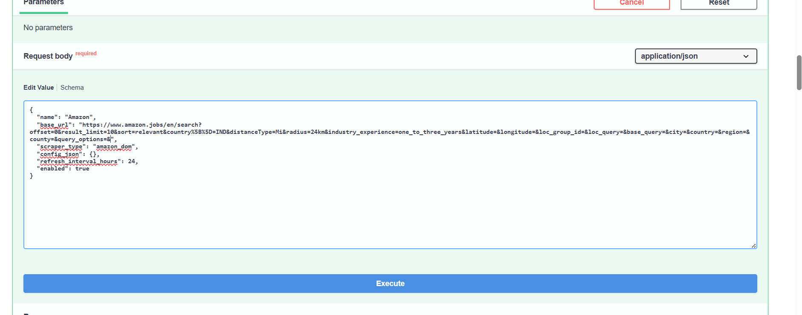
* **The system generates a unique Job Source ID for the registered source.**
        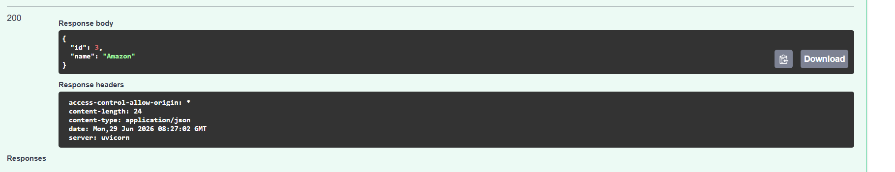

---

# 2.Scrapping job

---

* **The scraping pipeline uses the registered Job Source ID to invoke the appropriate Playwright scraper and begin collecting job postings from the associated website.**
   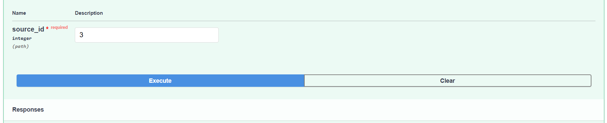
* **The Playwright scraper waits until all job listing containers are rendered before extracting job information.**
  
   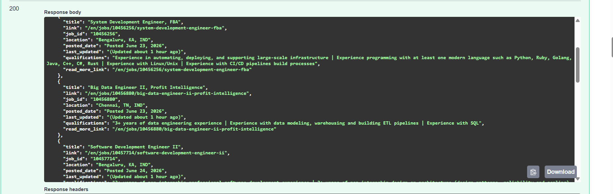

---

# 3.Automatic Sending referral request via email

---

* **The user uploads their resume, which is used to identify the most relevant job opportunities.**
   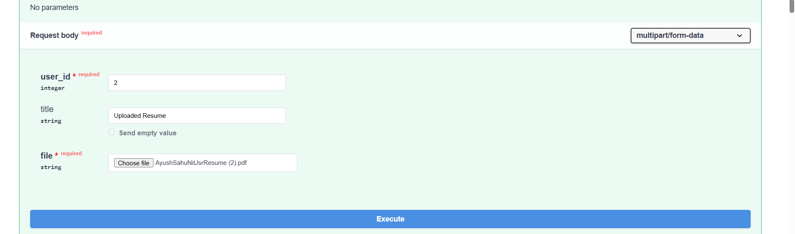

   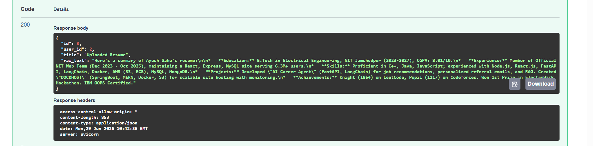

* **The user enters the contact details of the employee from whom they wish to request a referral.**
  
     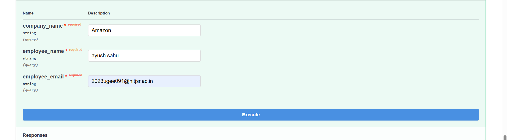

    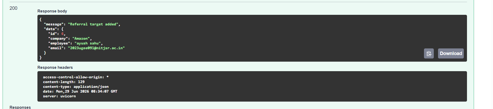

* **The user enters his own email info for automatic email sending**

    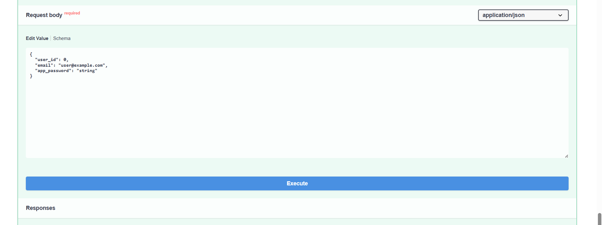

* **Relevant job opportunities are identified based on the user's profile, and referral requests are sent for the matched positions**
  
---

# 4.)RAG Knowledge Base
 ### 4.a)Supports ingestion of PDFs, YouTube videos, and Wikipedia as knowledge sources.
  
   ---

* **Inserting Scanned Pdfs**
         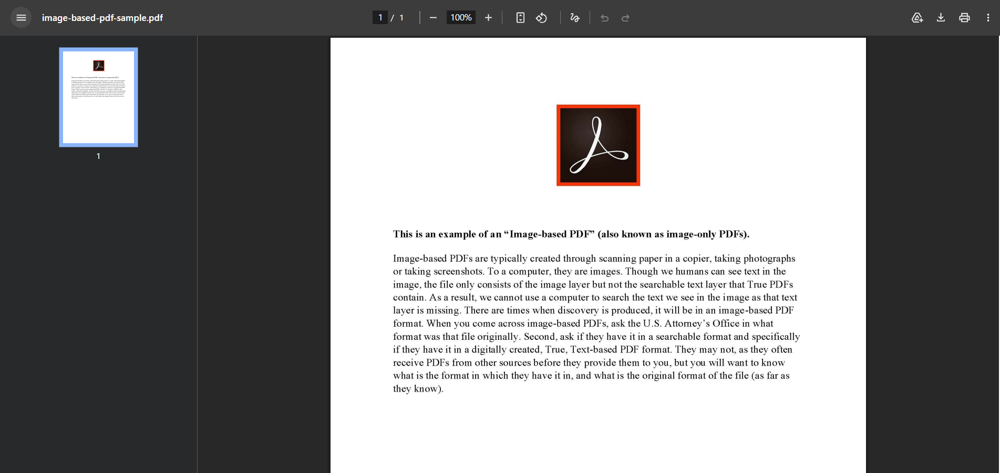
       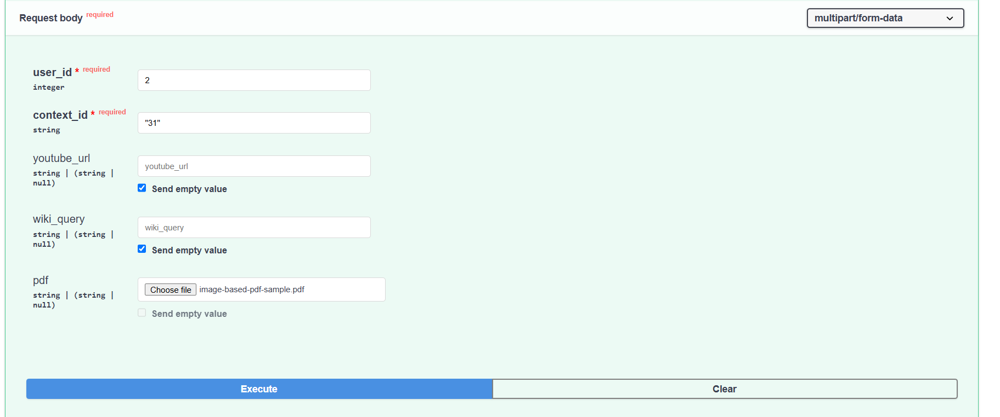
           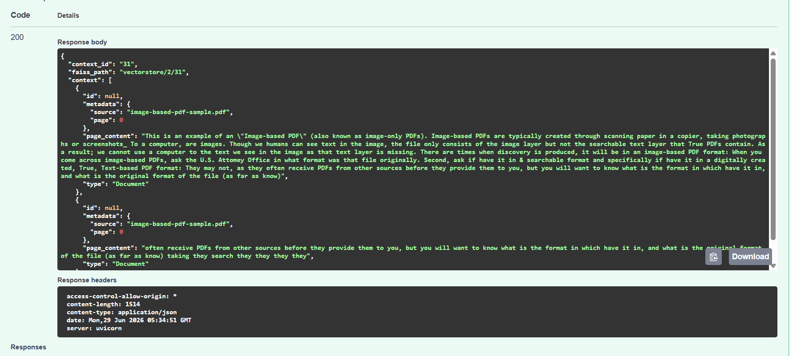

  
* **Inserting Text-Based Pdfs**
  
  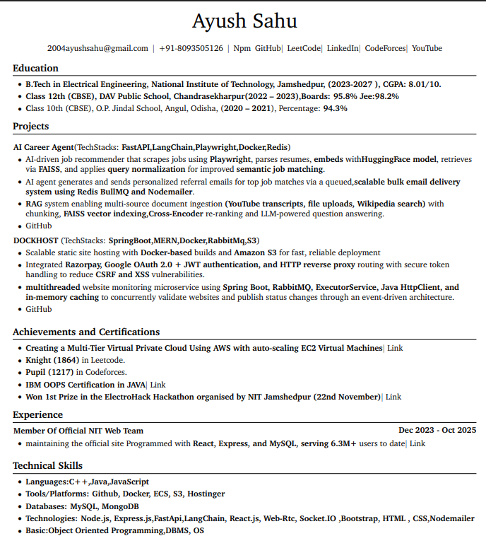
  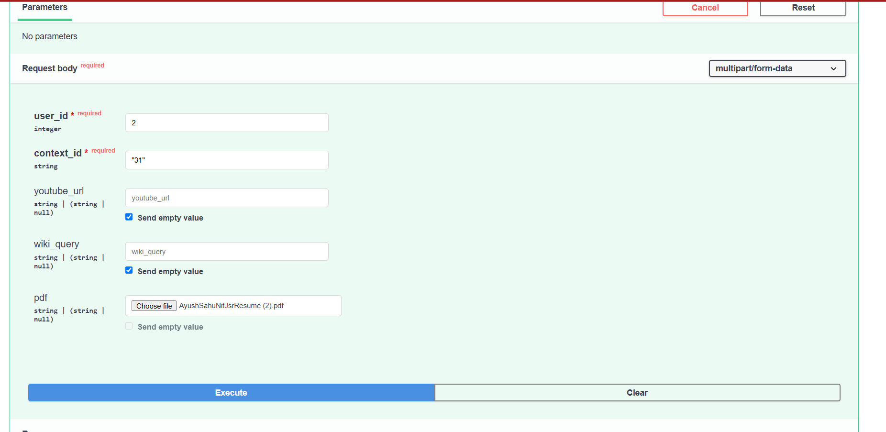
  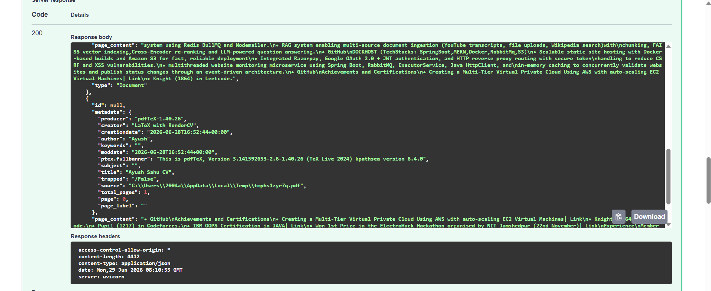

---
### 4.b) Inserting youtube url

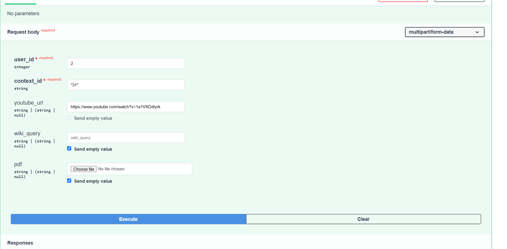
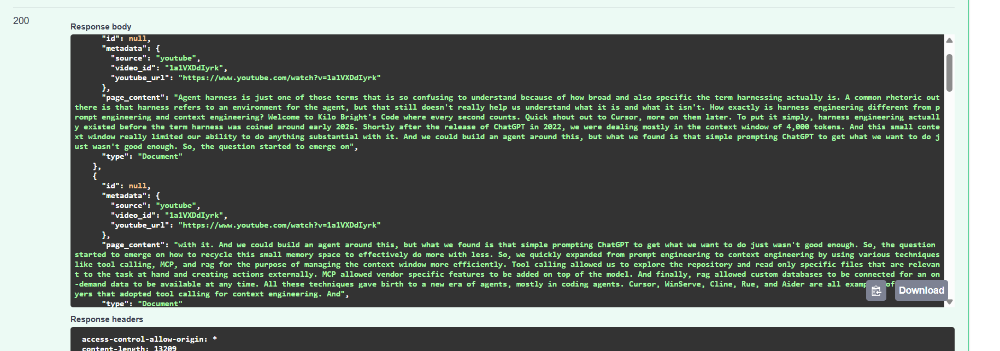

### 4.c) Inserting wiki pedia context
  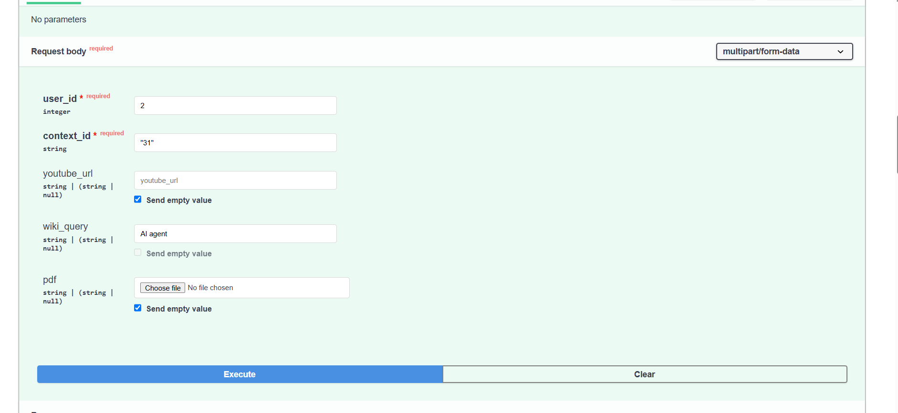
  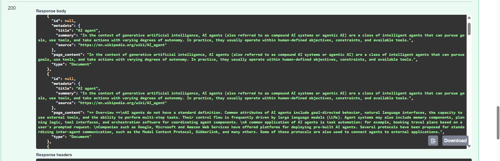

---
  
### 4.d) Automatically extracts, chunks, and embeds content for semantic retrieval.
### Enables users to ask context-aware questions based on the uploaded knowledge base.

   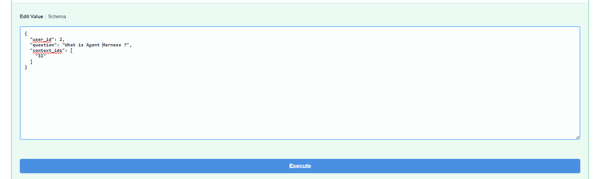

### Retrieves the most relevant context by reranking through cross-encoder before generating responses with the LLM.

  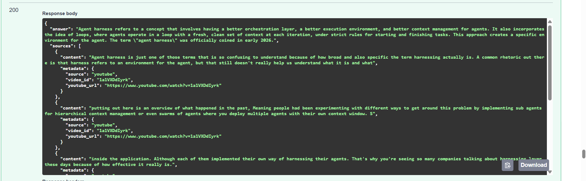

